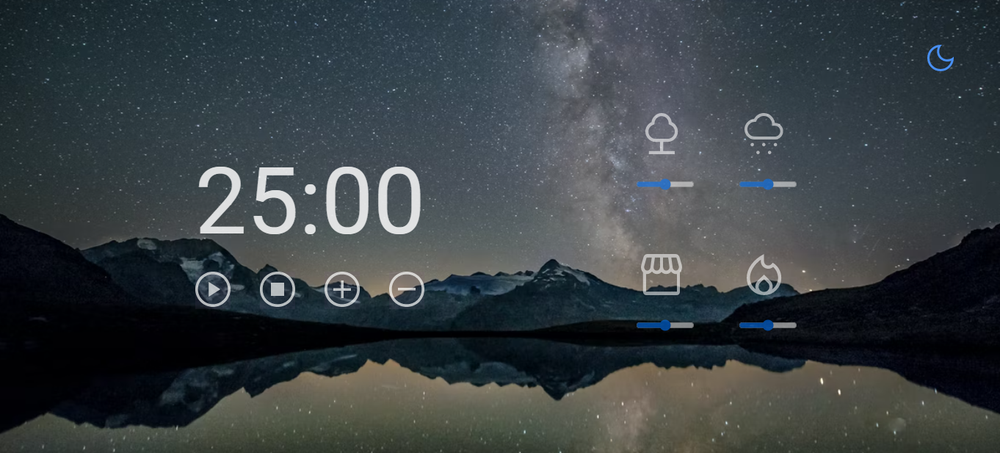
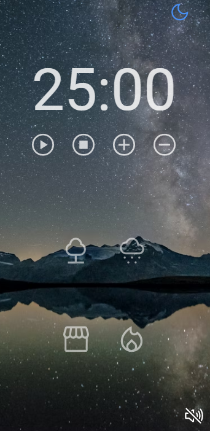

# Pomodoro Focus Timer 
 #### An Web Timer application build to be easy and clean for the User.
 
 <h1 align="center">Desktop Version</h1>
 <h1 align="center" display="flex">
  
   
</h1>

## An Web Timer application build to be easy and clean for the User.
### The Pomodoro Technique is a time management system that encourages people to work with the time they have—rather than against it. Using this method, you break your workday into 25-minute chunks separated by five-minute breaks. These intervals are referred to as pomodoros

# What I Learned
<!--ts-->
* Display Grid & Display Flex
* Callbacks
* DOM manipulation Using JS
* Clean Code Principles
* ES6 Modules
* Factory Pattern
* Dependency Injection
* HTML5 Audio
* Add songs using JS
* Clamp property
* Media queries

 <h1 align="center">Mobile Version</h1>
<h1 align="center "display="flex">
  
   
</h1>
